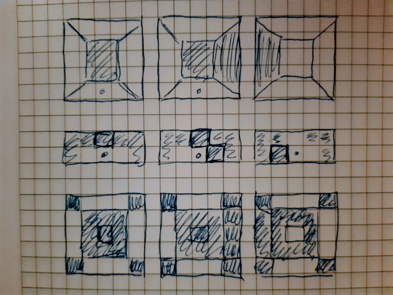

# Calliope mini maze game

## Introduction

This project is about programming the [Calliope mini V2](https://calliope-mini.github.io/v20/) in C++. See also [here](https://calliope.cc/en/calliope-mini/features) for the features of the device.  
Although there are some very good editors for the device like the [PXT from Microsoft (MakeCode)](https://makecode.calliope.cc/) and [Open Roberta Lab from Fraunhofer IAIS, Media Engineering Department (NEPO)](https://lab.open-roberta.org/) there is also the possibility to program the device with C++.  

To program with C and C++ check out https://github.com/calliope-mini and especially the following projects:  
- https://github.com/calliope-mini/calliope-demo: check the *source* folder for examples on how to use the different components of the Calliope mini.
- https://github.com/calliope-mini/calliope-project-template: use this project to setup the environment for programming and generating the neded *.hex* files for the Calliope mini.

## Documentation

[Here](https://lancaster-university.github.io/microbit-docs/) you can find the documentation of the *micro:bit* runtime which is built on top of the *ARM mbed* and *nordic nrf51* platforms.

## Project setup

After doing the steps from the [calliope-project-template](https://github.com/calliope-mini/calliope-project-template), overwrite the project files with the files of this repo.  
Notice that the original project template code is provided under the Apache-2.0 license.

#### Setup on manjaro

*Yotta* is available as pamac package in the *AUR* repositories. If `yt update` is done the system is compromised by many many things like python2 and rust and other things. So use the *timeshift* feature before.

### Compiling

Inside the *CMakeLists.txt* file a custom target *compile* is setup which does `yt build` in the source folder.  
The real reason of the *CMakeLists.txt* file is to enable syntax highlighting and stuff like that for the IDE.

#### Compiling on manjaro

The `yt build` will not work out of the box. Install the cross-compiler and tools from the official repositories.

### Installation on the Calliope mini

The generated *.hex* file lands in the *build/calliope-mini-classic-gcc/source/* folder and is named *calliope-project-template-combined.hex*. Copy this file into the mounted share *MINI* of the Calliope mini device connected to the PC with the USB-cable.

# The game

It is about imitating the good old dungeon crawlers like *The bards tale* or something like that. In this version at least walking around in a "3D-view" works. The goal is to find a special place on the map. As faster the little RGB LED is pulsing as nearer the final spot is. Use the buttons *A* and *B* to turn left and right and both at the same time for stepping forwards. Also some secrets are hidden.

## Concept "3D-view"



Beginning in the middle, the player is the dot in the lower middle and we can see the walls top down as little boxes.  
In the upper row we can see the walls shaded if we would stand inside the floor and we would have more than 5x5 pixels on the display.  
In the last row we can see the corresponding drawing as we do on the small dsiplay off the Calliope mini.  
We only see one field before us and one on the left and on the right.

# License

This template is available under the [BSD License 2.0](LICENSE)

```
Copyright (c) 2020, Andreas Kutscheid
All rights reserved.

Redistribution and use in source and binary forms, with or without
modification, are permitted provided that the following conditions are met:
* Redistributions of source code must retain the above copyright notice, this list of conditions and the following disclaimer.
* Redistributions in binary form must reproduce the above copyright notice, this list of conditions and the following disclaimer in the documentation and/or other materials provided with the distribution.
* Neither the name of the <organization> nor the names of its contributors may be used to endorse or promote products derived from this software without specific prior written permission.

THIS SOFTWARE IS PROVIDED BY THE COPYRIGHT HOLDERS AND CONTRIBUTORS "AS IS" AND ANY EXPRESS OR IMPLIED WARRANTIES, INCLUDING, BUT NOT LIMITED TO, THE IMPLIED WARRANTIES OF MERCHANTABILITY AND FITNESS FOR A PARTICULAR PURPOSE ARE DISCLAIMED. IN NO EVENT SHALL <COPYRIGHT HOLDER> BE LIABLE FOR ANY DIRECT, INDIRECT, INCIDENTAL, SPECIAL, EXEMPLARY, OR CONSEQUENTIAL DAMAGES (INCLUDING, BUT NOT LIMITED TO, PROCUREMENT OF SUBSTITUTE GOODS OR SERVICES; LOSS OF USE, DATA, OR PROFITS; OR BUSINESS INTERRUPTION) HOWEVER CAUSED AND ON ANY THEORY OF LIABILITY, WHETHER IN CONTRACT, STRICT LIABILITY, OR TORT (INCLUDING NEGLIGENCE OR OTHERWISE) ARISING IN ANY WAY OUT OF THE USE OF THIS SOFTWARE, EVEN IF ADVISED OF THE POSSIBILITY OF SUCH DAMAGE.
````


